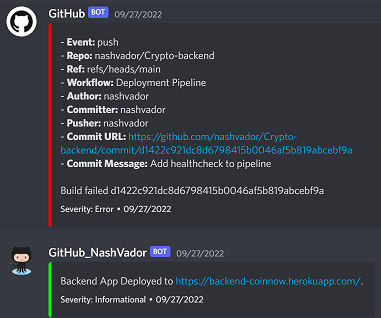

# CoinNow Backend App

Welcome to the backend of CoinNow, a crypto app that allows users to view CryptoCurrencies and potentially buy them.

The development was solely done by me - Nash Vador. And the project's purpose was meant to showcase my knowledge with backend applications.

I completed this app from June 9, 2022 - October 15, 2022 and I developed this project after work while I was employed as a tester.

# Live link

Here is the live [link](https://backend-coinnow.herokuapp.com/) to the backend API. Note that most of the endpoints are set up to respond to post requests instead of get requests.

# How Everything Works

- CI/CD Pipeline - For the pipeline, I had to learn YML so that I can incorporate everything. I ran everything on the latest ubuntu environment and on node version 16. I made sure to run linting, testing and installing steps prior to deploying the server. In the deployment steps I included an if statement: `if: ${{ github.event_name == 'push' && !contains(github.event.head_commit.message, '#skip') }}` in order to protect the main branch or even skip deployment if the github commit message states that it is required. I also created a custom endpoint for a healthcheck in my application at /api/healthCheck, and a rollback so that if the request does not return anything it rollsback to the previous deployment. I also included discord  so that people (mainly I) can be alerted after the build fails or passes. Finally, I added release tagging with `needs: [simple_deployment_pipeline]` to ensure that only deployments are tagged.

- Schemas - I've used mongoose to create two schemas - a user schema and a portfolio schema (or a coin schema). The user Schema references the portfolio schema and vice versa. On return, I make sure that the password hash is not shown and, as such, deleted it from the schema itself.

- Calling the Third Party Api - To avoid CORS errors, I've mainly taken calling the CoinGecko API through the backend, this can be found in the [apiInfoRoutes.ts](https://github.com/nashvador/Crypto-backend/blob/main/routes/apiInfoRoutes.ts).

- The Actual Express Application - The actual express application is found on the [app.ts](https://github.com/nashvador/Crypto-backend/blob/main/app.ts) file, with the index.ts file being the server.

- User Creation - Most of the user creation works through bcrypt (`const passwordHash: string = await bcrypt.hash(password, saltRounds)`). I used 10 salt rounds to give the maximum security to passwords and then store the hashed version.

- Login - For most of my login functionality, I've used json web token. I passed the user authentication/verification through the [middleware](https://github.com/nashvador/Crypto-backend/blob/main/utils/middleware.ts) so it's easily passable to the different routes that may need it (`const decodedToken = jwt.verify(request.token, process.env.SECRET)`).

- Config File - I've used dotenv to allow access to most of my information thats stored in my .env file. Most of this information is stored in [config.ts](https://github.com/nashvador/Crypto-backend/blob/main/utils/config.ts).

- Testing - Most of my testing was done through Jest, and it was mainly integration testing. I've added tests for User creation, to check if the third party API works, and if Portfolios can be created.

# Why I chose these technologies

- Github Actions for CI/CD - Github Actions is one of my first introductions to the realm of CI/CD. I chose it because it is extremely convenient - you can develop workflows right in the repository.

- TypeScript - As I was using JavaScript in my earlier practice applications, I noticed I was constantly getting TypeErrors that would take hours to fix. Typescript was introduced to prevent these errors before they even occured.

# My struggles and what I learned

- Deployment - Deployment to Heroku was an absolute terror! As I dove deeper into the steps of deployment, I kept on getting a `Module not found: Error: Can't resolve 'fs' in` error. That error sent me down a huge rabbit hole which forced me to add scripts to the package.json file and to remove some scripts. Finally, I discovered that Heroku does not support native TypeScript and I had to create a build step in between for deployment.

- Typescript - Since I had no experience with Object Oriented languages, coming from JavaScript to TypeScript was a huge struggle. Stack Overflow and Google were my best bets when assigning types.

- Testing - When I creating the tests, Jest had an issue with creating a server. So, in the [index.ts](https://github.com/nashvador/Crypto-backend/blob/main/index.ts) file, I added a way to export the server and use it in Jest
